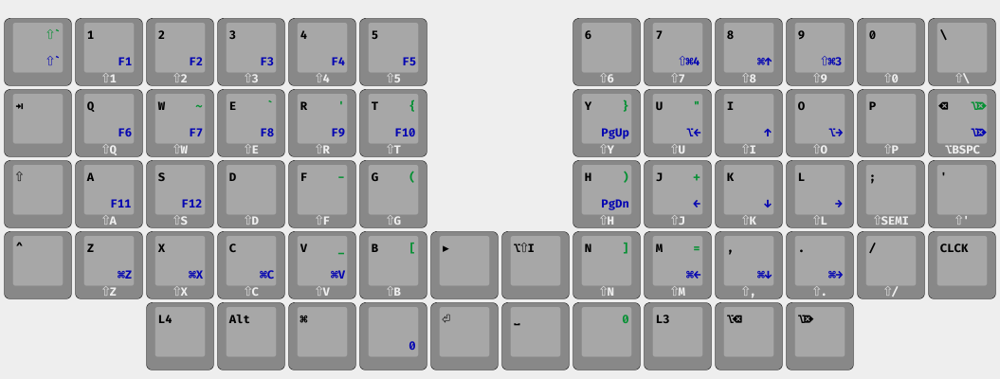

# ZMK Config for Sofle Choc Wireless

Board: [Sofle Choc Wireless](https://github.com/db-ok/SofleChocWireless) 
ZMK: [Personal Fork](https://github.com/seanuleh/zmk)

# Additions/Fixes

* Underglow Support added via boards/nice_nano_v2.overlay

# Layout

