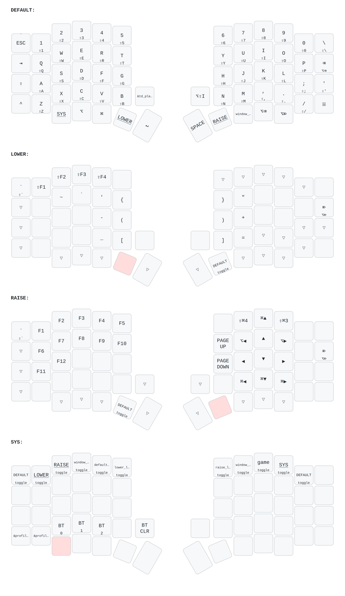

# ZMK Config for George's Sofle Choc
Board: Sofle Choc v2.1 (Brian Low) with nice!nano-compatible nRF52840 SuperMini clones.

This `george` branch is a stripped-down build of the `sofled` config for a simple board:
* **No dongle**: the left half is the central and connects to the computer directly (USB or Bluetooth).
* **No displays, no LEDs, no rotary encoders.**
* **No batteries**: plug USB into the **left** half. The TRRS cable only carries power to the right half; the halves talk over Bluetooth (ZMK can't do single-wire wired split on the Sofle).

## Flipped controllers
Both SuperMinis on this board are mounted flipped (face up), so every pad lands on the pin directly opposite it. The firmware works around this: `sofled_left.overlay` and `sofled_right.overlay` remap the matrix rows/columns. Side effects:
* The board's VCC and GND nets are swapped on both halves. Because both are swapped the same way, powering the right half over TRRS is still fine.
* The board's reset button shorts 3.3V to ground. It works, but double-tapping a wire between RST and GND on the controller itself is gentler.
* If you ever remount the controllers the normal way, revert the `row-gpios`/`col-gpios` overrides in both overlays.

## Firmware
GitHub Actions builds on every push. Download the `firmware` artifact from the latest run:
* `sofled_left-nice_nano_nrf52840_zmk-zmk.uf2`: left half
* `sofled_right-nice_nano_nrf52840_zmk-zmk.uf2`: right half
* `settings_reset-nice_nano_nrf52840_zmk-zmk.uf2`: clears pairing data

## Flashing
1. Unplug the TRRS cable.
2. For each half: plug in USB, double-tap reset, copy `settings_reset` onto the drive. Repeat and copy that half's firmware.
3. Plug the TRRS cable in (with USB unplugged), then plug USB into the left half.
4. Pair "Sofle" over Bluetooth, or just use USB.

**Never plug or unplug the TRRS cable while USB is connected.** It can damage the controllers.

## Customising
* Keymap: `config/sofled.keymap`
* Global settings: `config/sofled.conf`
* Per-half settings: `boards/shields/sofled/sofled_{left,right}.conf`

Sleep is disabled because there are no batteries. If you add batteries later, set `CONFIG_ZMK_SLEEP=y` in both per-half `.conf` files.

## Layout

